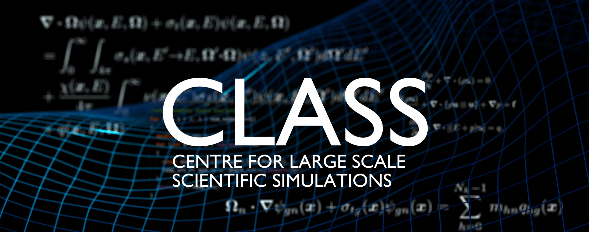

# C++ short course
Students at CLASS always end up requiring to learn C++. This here is a basic short course to get you started.

 1. [What are the absolute basics you need?](chapters/c1_basic_setup.md)
 2. [A simple "Hello World!" program](chapters/c2_hello_world.md)
 3. [How c++ works](chapters/c3_how_c%2B%2B_works.md)
 4. [Variables](chapters/c4_variables.md)
 5. [Simple mathematics](chapters/c5_simple_mathematics.md)
 6. Functions
 6. Work in progress

For more in-depth learning I would refer people to the youtube channel [The Cherno](https://www.youtube.com/c/TheChernoProject), specifically his [c++ series](https://www.youtube.com/watch?v=18c3MTX0PK0&list=PLlrATfBNZ98dudnM48yfGUldqGD0S4FFb). The list of crucial videos to watch are:
 1.  [How c++ works](https://www.youtube.com/watch?v=SfGuIVzE_Os&list=PLlrATfBNZ98dudnM48yfGUldqGD0S4FFb&index=5)
 2.  [How the c++ compiler works](https://www.youtube.com/watch?v=SfGuIVzE_Os&list=PLlrATfBNZ98dudnM48yfGUldqGD0S4FFb&index=6)
 3.  [How the c++ linker works](https://www.youtube.com/watch?v=SfGuIVzE_Os&list=PLlrATfBNZ98dudnM48yfGUldqGD0S4FFb&index=7)
 4.  [Variables in c++ (`char`, `int`, `double`, etc.)](https://www.youtube.com/watch?v=SfGuIVzE_Os&list=PLlrATfBNZ98dudnM48yfGUldqGD0S4FFb&index=8)
 5.  [Functions in c++](https://www.youtube.com/watch?v=SfGuIVzE_Os&list=PLlrATfBNZ98dudnM48yfGUldqGD0S4FFb&index=9)
 6.  [c++ header files](https://www.youtube.com/watch?v=SfGuIVzE_Os&list=PLlrATfBNZ98dudnM48yfGUldqGD0S4FFb&index=10)
 7.  [Conditional statements and branches (`if` statements)](https://www.youtube.com/watch?v=SfGuIVzE_Os&list=PLlrATfBNZ98dudnM48yfGUldqGD0S4FFb&index=12)
 8.  [Loops (`for` and `while`)](https://www.youtube.com/watch?v=SfGuIVzE_Os&list=PLlrATfBNZ98dudnM48yfGUldqGD0S4FFb&index=14)
 9.  [Control flow in c++ (`continue`, `break`, `return`)](https://www.youtube.com/watch?v=SfGuIVzE_Os&list=PLlrATfBNZ98dudnM48yfGUldqGD0S4FFb&index=15)
 10. [Pointers in c++ (`int*`)](https://www.youtube.com/watch?v=SfGuIVzE_Os&list=PLlrATfBNZ98dudnM48yfGUldqGD0S4FFb&index=16)
 11. [References in c++ (`int&`)](https://www.youtube.com/watch?v=SfGuIVzE_Os&list=PLlrATfBNZ98dudnM48yfGUldqGD0S4FFb&index=17)
 12. [Classes in c++ (`class`)](https://www.youtube.com/watch?v=SfGuIVzE_Os&list=PLlrATfBNZ98dudnM48yfGUldqGD0S4FFb&index=18)
 13. [Classes vs structs (`struct`) in c++](https://www.youtube.com/watch?v=SfGuIVzE_Os&list=PLlrATfBNZ98dudnM48yfGUldqGD0S4FFb&index=19)
 14. [How to write a c++ class](https://www.youtube.com/watch?v=SfGuIVzE_Os&list=PLlrATfBNZ98dudnM48yfGUldqGD0S4FFb&index=20)
 15. [The `static` keyword in c++](https://www.youtube.com/watch?v=SfGuIVzE_Os&list=PLlrATfBNZ98dudnM48yfGUldqGD0S4FFb&index=21)
 16. [`static` for classes and struct in c++](https://www.youtube.com/watch?v=SfGuIVzE_Os&list=PLlrATfBNZ98dudnM48yfGUldqGD0S4FFb&index=22)
 17. [`enum` in c++](https://www.youtube.com/watch?v=SfGuIVzE_Os&list=PLlrATfBNZ98dudnM48yfGUldqGD0S4FFb&index=23)
 18. [Constructors in c++](https://www.youtube.com/watch?v=SfGuIVzE_Os&list=PLlrATfBNZ98dudnM48yfGUldqGD0S4FFb&index=24)
 19. [Destructors in c++](https://www.youtube.com/watch?v=SfGuIVzE_Os&list=PLlrATfBNZ98dudnM48yfGUldqGD0S4FFb&index=25)
 20. [Inheritance in c++](https://www.youtube.com/watch?v=SfGuIVzE_Os&list=PLlrATfBNZ98dudnM48yfGUldqGD0S4FFb&index=26)
 21. [`virtual` functions in c++](https://www.youtube.com/watch?v=SfGuIVzE_Os&list=PLlrATfBNZ98dudnM48yfGUldqGD0S4FFb&index=27)
 22. [Interfaces in c++ (pure virtual functions)](https://www.youtube.com/watch?v=SfGuIVzE_Os&list=PLlrATfBNZ98dudnM48yfGUldqGD0S4FFb&index=28)
 23. [Visibility in c++](https://www.youtube.com/watch?v=SfGuIVzE_Os&list=PLlrATfBNZ98dudnM48yfGUldqGD0S4FFb&index=29)
 24. [Arrays in c++ (`std::array`)](https://www.youtube.com/watch?v=SfGuIVzE_Os&list=PLlrATfBNZ98dudnM48yfGUldqGD0S4FFb&index=30)
 25. [How `std::string` works in c++ (and how to use them)](https://www.youtube.com/watch?v=SfGuIVzE_Os&list=PLlrATfBNZ98dudnM48yfGUldqGD0S4FFb&index=31)
 26. [`const` in c++](https://www.youtube.com/watch?v=SfGuIVzE_Os&list=PLlrATfBNZ98dudnM48yfGUldqGD0S4FFb&index=33)
 27. [The `mutable` keyword](https://www.youtube.com/watch?v=SfGuIVzE_Os&list=PLlrATfBNZ98dudnM48yfGUldqGD0S4FFb&index=34)
 28. [Member initializer lists in c++](https://www.youtube.com/watch?v=SfGuIVzE_Os&list=PLlrATfBNZ98dudnM48yfGUldqGD0S4FFb&index=35)
 29. [Ternary operators ("the elvis-operator")](https://www.youtube.com/watch?v=SfGuIVzE_Os&list=PLlrATfBNZ98dudnM48yfGUldqGD0S4FFb&index=36)