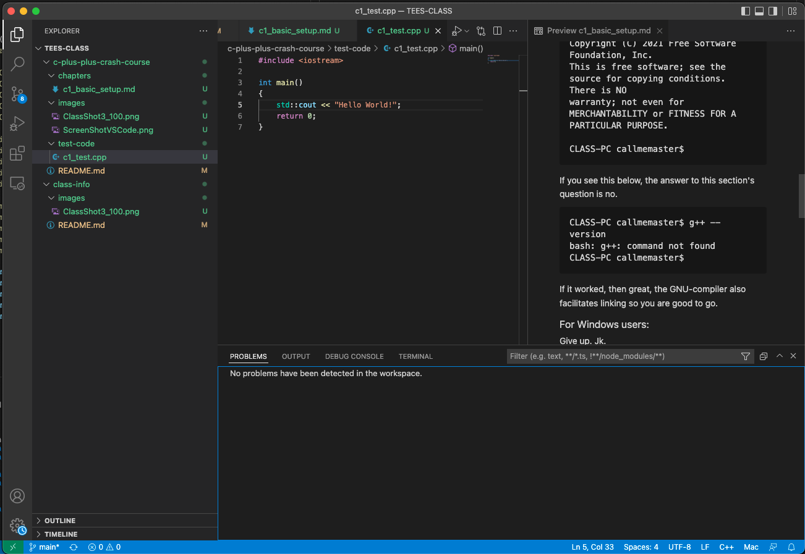

# Chapter 1 - What are the absolute basics you need?
Well... your ability to set up your machine for coding with C++ is going to escalate in difficulty when the following conditions apply: Condition A - your machine is locked-down by tyrannical admin-privilages that prevent you from installing absolutely anything (wink wink Texas A&M IT). Condition B - You are new to compile environments, operating terminal commands, and/or new to the bare-bones of a unix system.

## An overview:
- We want to be able to type ```g++ --version``` in a terminal and it works. On windows this will require MinGW.
- We want to have a rudimentary IDE available (for now VSCode). And we want to be able to run the command above from the built-in terminal.

## Step 1: Can you open a terminal?
I know this might be trivial for a linux/macos user but we have to help our fellow Windows users. If you cannot open a terminal then try the following.

### For linux/macos users: 
Google it. Should be easy.

### For Windows users:  
Opening the terminal used to be as easy as clicking on the start menu, searching for `cmd.exe` and then executing that, however, recent operating system versions added many more options. The classical `Command Prompt` was one type of terminal but its commands are antiquated and hard to learn, `Powershell` seems to be a little more modern with more commands akin to a unix system, and finally the `Windows Subsystem for Linux (WSL)` offers a full-fledged unix system to work on (normally a GUI-less version of Ubuntu).  
I recommend using the `WSL` because it will make googling things a lot easier, but `Powershell` can also be used.  
  
### OK, I can open a terminal, move to the next step
↓  
↓

## Step 2: Can you execute a c++ compiler and/or linker?

### For linux/macos users:
For you guys this will come down to being able to run the following:
```
g++ --version
```
and seeing this (or some other version):
```
CLASS-PC callmemaster$ g++ --version
g++ (Homebrew GCC 11.2.0_3) 11.2.0
Copyright (C) 2021 Free Software Foundation, Inc.
This is free software; see the source for copying conditions.  There is NO
warranty; not even for MERCHANTABILITY or FITNESS FOR A PARTICULAR PURPOSE.

CLASS-PC callmemaster$ 
```
If you see this below, the answer to this section's question is no.
```
CLASS-PC callmemaster$ g++ --version
bash: g++: command not found
CLASS-PC callmemaster$
```

If it worked, then great, the GNU-compiler also facilitates linking so you are good to go.

### For Windows users:
Give up. Jk.  
Setting up a terminal based compile environment is a hassle on Windows machines. Even more so if you don't have admin rights. Thusfar the best option I have come across is to install VSCode on windows, then to set up WSL, then to setup VSCode to remotely connect to WSL. Bingo that works best.  
Alternatively you can install MinGW and put it's bin folder in your PATH environment variable. Good luck with that. It will require restarting.  
If you go down the rabbit-hole of install Visual Studio then good luck gaining the ability to run its compiler and linker (separately).

## Step 3: Can you install VSCode and perform steps 1 and 2?
There are many text editors that you can use to provide pretty little colors to your code. For a long time I used notepad++ and if you are REALLY geeky you can go for using vim, as a hard-core nerd. For the rest of us that are mere mortals there is a nice little editor called VSCode that even has intellisense.  
Intellisense, Active-code-analysis, or whatever you call it is the real-time analysis of the code you write whereby errors or warnings will be indicated without you even needing to compile the code. It is technically capable of everything an Integrated Development Environment (IDE) offers.  


### NOTE: Using an IDE for scientific computing is highly recommended! It allows you to learn faster and improves the quality of your work.

